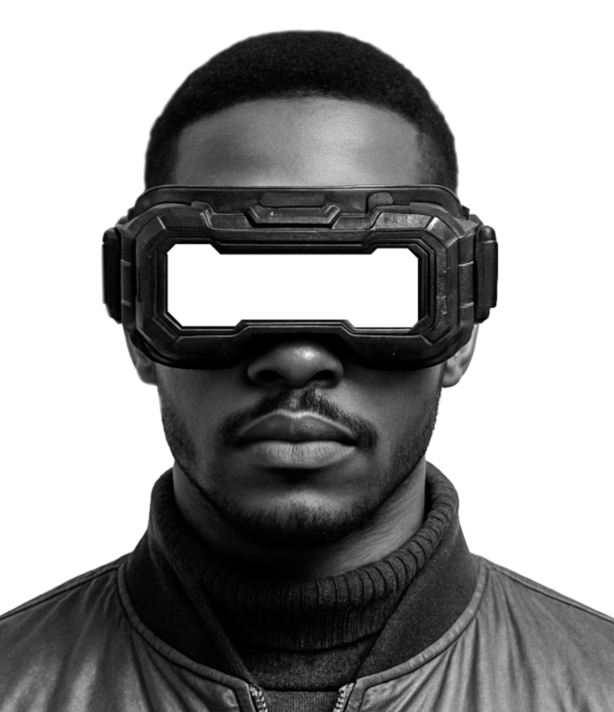

# GLITCHED

GLITCHED

## Glitched

> **"Reality is just a perception glitch in the virtual world."**

## 🔌 Welcome to the Edge

Glitched is an experiment interface that blends cyberpunk aesthetics with different opensource web technologies.  Created as an exploration of the boundaries between reality and digital space.

## 🛠️ Technology Stack

### Core Technologies
- **HTML5/CSS3**: Foundation of the interface structure
- **JavaScript (ES6+)**: Powers all interactive elements and animations
- **Canvas API**: Renders particles, ripples, and dynamic visual effects
- **Tailwind CSS**: Utility-first styling with custom theme extensions

### Libraries & Tools
- **GSAP**: Animation library for smooth transitions and effects
- **SplitType**: Text manipulation for character-level animations
- **Custom Modules**: Modular components for effects (particles, HUD, ripples)

### Physics & Math
- **Spring Physics**: Custom-implemented spring equations for natural motion
- **Vector Mathematics**: Used for cursor trajectory and particle behavior
- **Perlin Noise**: Creates organic movement in background animations

## 🔄 VR Mode Components

When VR mode is activated, multiple systems work in concert:

1. **Retro Grid**: A perspective-transformed infinite grid creates depth
2. **Particle System**: Interactive floating particles with physics behavior
3. **Ripple Effect**: Expanding circular waves emanate from click points
4. **HUD Elements**: Heads-up display components appear with system data
5. **Text Glitching**: Text elements distort with RGB shift and displacement
6. **Border Effects**: Pulsing red glow surrounds the interface

## 🎮 How It Works

The project is built on a component-based architecture with several key systems:

### Effect Orchestration
The main controller in `js/effect-4/index.js` coordinates all visual elements and manages state. VR mode is toggled through a central `activateVRMode()` function that:

1. Activates the red glowing border and text glitch effects
2. Intensifies the retro grid with smaller cells and color change
3. Increases particle count, speed and brightness
4. Changes ripple size and opacity
5. Activates the HUD overlay system
6. Automatically resets after 2 seconds

### Custom Component System
Each visual effect is encapsulated in its own class:

- `SmoothCursor`: Physics-based cursor with spring dynamics
- `RetroGrid`: Animated perspective grid background
- `Particles`: Floating interactive particles
- `Ripple`: Click-based circular wave animations
- `HUD`: Heads-up display with system information

## 🔮 Future Development

- WebGL integration for 3D elements
- Audio reactivity for enhanced immersion
- Hand gesture recognition via webcam
- Full-screen VR mode with head tracking
 
